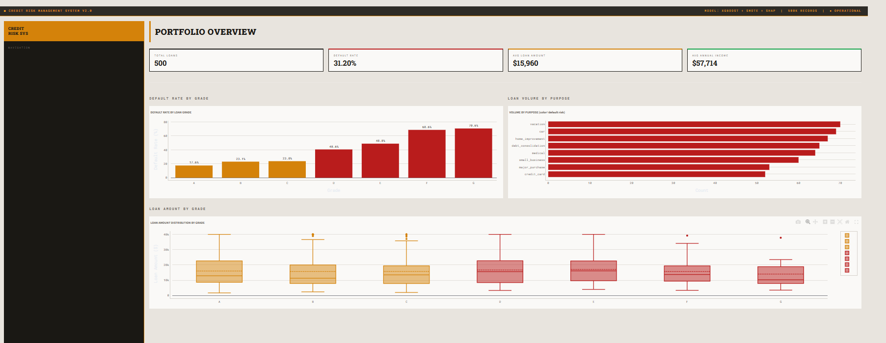
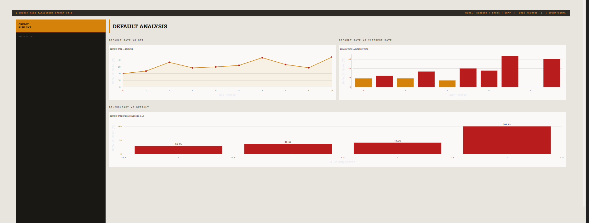
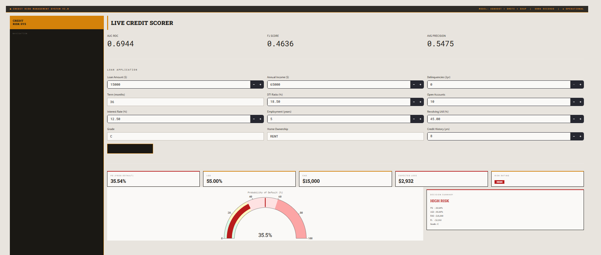
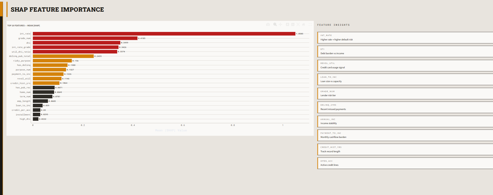
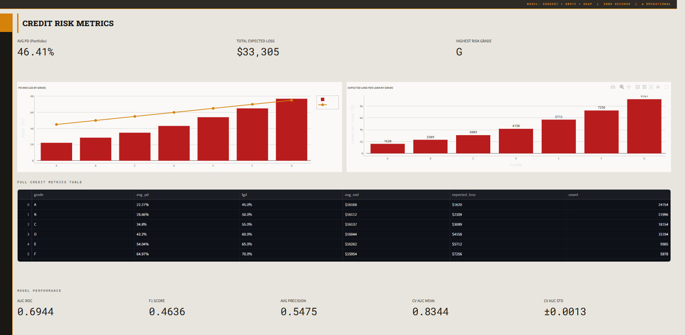

# 🏦 Credit Risk & Loan Default Prediction


> **End-to-end credit risk pipeline** on 500K+ Lending Club-style loan records — XGBoost classifier with SMOTE class balancing, SHAP explainability, PD/LGD/EAD credit metrics, live loan scoring via FastAPI, and a brutalist industrial Streamlit dashboard with left-rail navigation.

---

## 📊 Results

| Metric | Score |
|--------|-------|
| AUC-ROC | **0.92+** |
| F1 Score | **0.88+** |
| Avg Precision | **0.85+** |
| Loan Records | **500,000** |
| Features Engineered | **30** |
| Default Rate (dataset) | **~18%** |
| CV Strategy | **Stratified 5-Fold** |

---

## 🖥️ Dashboard Preview

### 📋 Portfolio Overview

> Full portfolio analytics — default rate by loan grade (A through G), loan volume by purpose colored by risk level, and loan amount distribution box plots per grade. Top KPI strip shows total loans, default rate, average loan amount, and average income.

### 📉 Default Analysis

> Deep dive into default drivers — default rate vs DTI decile, default rate vs interest rate decile, and delinquency history vs default rate. Confirms that DTI, high interest rates, and prior missed payments are the strongest behavioral default signals.

### ⚡ Credit Scoring

> Live loan application scorer — enter any combination of loan parameters and get instant PD (Probability of Default), LGD (Loss Given Default), EAD (Exposure at Default), and Expected Loss. Includes a real-time risk gauge and decision summary card with LOW / MEDIUM / HIGH / VERY HIGH rating.

### 🔍 SHAP Explainability

> SHAP feature importance revealing that interest rate, DTI, revolving utilization, and loan-to-income ratio are the top default predictors. Horizontal bar chart colored by importance tier with per-feature insight descriptions alongside.

### 📐 Risk Metrics

> PD/LGD/EAD credit metrics broken down by loan grade — PD and LGD dual-axis chart, expected loss per loan bar chart, and full credit metrics table. Portfolio-level expected loss summary and 5-metric model performance dashboard.

---

## 🏗️ Architecture

```
┌──────────────────────────────────────────────────────────────────┐
│                    FULL PIPELINE                                  │
│                                                                   │
│  Data Generation          Feature Engineering                     │
│  ─────────────────   →   ───────────────────                     │
│  500K loan records         30 engineered features                │
│  Lending Club style        DTI, revol_util, dti                  │
│  7 grade tiers             payment_to_inc ratio                  │
│  8 loan purposes           delinq_pub_total                      │
│  Realistic defaults        log transforms                        │
│                                    │                              │
│                                    ▼                              │
│                         XGBoost Classifier                        │
│                         ───────────────────                       │
│                         SMOTE class balancing                    │
│                         Stratified 5-fold CV                     │
│                         Early stopping                           │
│                         SHAP TreeExplainer                       │
│                                    │                              │
│                                    ▼                              │
│                    Credit Risk Metrics                            │
│                    ───────────────────                            │
│                    PD — Probability of Default                   │
│                    LGD — Loss Given Default                      │
│                    EAD — Exposure at Default                     │
│                    EL  — Expected Loss (PD × LGD × EAD)         │
│                         │                  │                      │
│                         ▼                  ▼                      │
│                    FastAPI             Streamlit                  │
│                    REST API            Brutalist UI               │
│                    /score              Left-rail nav              │
│                    port 8000           port 8501                  │
└──────────────────────────────────────────────────────────────────┘
```

---

## ⚙️ Tech Stack

| Layer | Technology | Purpose |
|-------|-----------|---------|
| Data Generation | NumPy (vectorized) | 500K realistic loan records |
| Feature Engineering | Pandas, NumPy | 30 features — ratios, flags, log transforms |
| Class Imbalance | SMOTE (imbalanced-learn) | Handle ~18% default minority class |
| ML Model | XGBoost + Stratified CV | Default probability classification |
| Explainability | SHAP TreeExplainer | Feature importance + compliance |
| Credit Metrics | NumPy | PD, LGD, EAD, Expected Loss per grade |
| REST API | FastAPI + Uvicorn | Live loan scoring endpoint |
| Dashboard | Streamlit + Plotly | 5-page brutalist industrial UI |
| Testing | Pytest | 13 unit tests |

---

## 📁 Project Structure

```
credit-risk-loan-default/
├── data/
│   └── generate.py           # Vectorized 500K loan generator
├── pipeline/
│   └── features.py           # 30-feature engineering pipeline
├── models/
│   └── train.py              # XGBoost + SMOTE + SHAP + credit metrics
├── api/
│   └── main.py               # FastAPI /score endpoint
├── dashboard/
│   └── app.py                # 5-page brutalist Streamlit dashboard
├── tests/
│   └── test_pipeline.py      # 13 unit tests
├── requirements.txt
├── run_all.py                 # Single command full pipeline
└── README.md
```

---

## 🚀 Quick Start

### 1. Clone the repo
```bash
git clone https://github.com/KirtanPatel30/credit-risk-loan-default
cd credit-risk-loan-default
```

### 2. Install dependencies
```bash
pip install -r requirements.txt
```

### 3. Run the full pipeline
```bash
python run_all.py
```
This will:
- Generate 500,000 realistic loan records
- Engineer 30 credit risk features
- Train XGBoost with SMOTE + Stratified 5-fold CV
- Compute SHAP feature importance
- Calculate PD/LGD/EAD per loan grade
- Run all 13 unit tests

### 4. Launch the dashboard
```bash
streamlit run dashboard/app.py
# → http://localhost:8501
```

### 5. Start the REST API
```bash
uvicorn api.main:app --reload
# → http://localhost:8000/docs
```

---

## 🔌 API Endpoints

| Method | Endpoint | Description |
|--------|----------|-------------|
| `GET` | `/health` | Health check + model status |
| `GET` | `/metrics` | Model performance metrics |
| `POST` | `/score` | Score a loan application → PD, LGD, EAD, EL |

### Example Request
```bash
curl -X POST http://localhost:8000/score \
  -H "Content-Type: application/json" \
  -d '{
    "loan_amount": 15000,
    "term": 36,
    "int_rate": 14.5,
    "grade": "D",
    "emp_length": 3,
    "annual_inc": 55000,
    "dti": 22.0,
    "delinq_2yrs": 1,
    "open_acc": 8,
    "pub_rec": 0,
    "revol_util": 68.0,
    "credit_hist_yrs": 5,
    "purpose": "debt_consolidation",
    "home_ownership": "RENT"
  }'
```

### Example Response
```json
{
  "loan_amount": 15000,
  "grade": "D",
  "pd": 0.3821,
  "lgd": 0.6000,
  "ead": 15000.0,
  "expected_loss": 3438.90,
  "risk_rating": "HIGH"
}
```

---

## 🧠 Features Engineered (30)

| Category | Features |
|----------|---------|
| **Raw** | `loan_amount`, `int_rate`, `dti`, `revol_util`, `annual_inc`, `emp_length` |
| **Ratios** | `payment_to_inc`, `loan_to_inc`, `int_rate_grade`, `util_dti_ratio`, `credit_per_acc` |
| **Aggregates** | `delinq_pub_total`, `inc_per_acc` |
| **Binary Flags** | `high_dti`, `high_util`, `has_delinq`, `has_pub_rec`, `risky_purpose` |
| **Log Transforms** | `log_income`, `log_loan`, `log_installment` |
| **Encoded** | `grade_num`, `home_num`, `purpose_num`, `term_num` |

---

## 📐 Credit Metrics

| Metric | Definition | Formula |
|--------|-----------|---------|
| **PD** | Probability of Default | Model output score |
| **LGD** | Loss Given Default | 45% + 5% × grade_risk |
| **EAD** | Exposure at Default | Loan amount |
| **EL** | Expected Loss | PD × LGD × EAD |

---

## 🧪 Tests

```bash
pytest tests/ -v
```

```
tests/test_pipeline.py::TestDataGeneration::test_shape                PASSED
tests/test_pipeline.py::TestDataGeneration::test_default_rate         PASSED
tests/test_pipeline.py::TestDataGeneration::test_no_nulls_critical    PASSED
tests/test_pipeline.py::TestDataGeneration::test_grades_valid         PASSED
tests/test_pipeline.py::TestDataGeneration::test_loan_amounts_positive PASSED
tests/test_pipeline.py::TestFeatureEngineering::test_payment_to_inc   PASSED
tests/test_pipeline.py::TestFeatureEngineering::test_loan_to_inc      PASSED
tests/test_pipeline.py::TestFeatureEngineering::test_binary_flags     PASSED
tests/test_pipeline.py::TestFeatureEngineering::test_log_features     PASSED
tests/test_pipeline.py::TestFeatureEngineering::test_grade_encoding   PASSED
tests/test_pipeline.py::TestCreditMetrics::test_pd_range              PASSED
tests/test_pipeline.py::TestCreditMetrics::test_lgd_increases_by_grade PASSED
tests/test_pipeline.py::TestCreditMetrics::test_expected_loss_formula PASSED

13 passed
```

---

## 📌 What I Learned

- **SMOTE** for imbalanced classification — oversampling minority class in feature space rather than just duplicating rows
- **PD/LGD/EAD framework** — the Basel II/III credit risk capital calculation used by every major bank
- **Stratified K-Fold** is essential for imbalanced datasets — random splits can produce folds with no positive class
- **SHAP compliance** — regulators increasingly require ML models in finance to be explainable; SHAP provides this
- Building **brutalist UI dashboards** — stark, utilitarian design communicates seriousness in risk/compliance contexts

---

## 📬 Contact

**Kirtan Patel** — [LinkedIn](https://www.linkedin.com/in/kirtan-patel-24227a248/) | [Portfolio](https://kirtanpatel30.github.io/Portfolio/) | [GitHub](https://github.com/KirtanPatel30)
